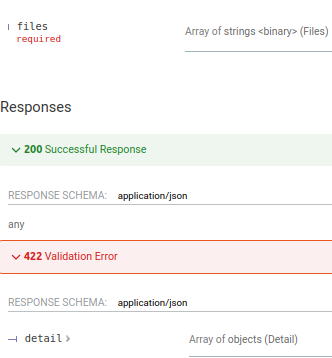
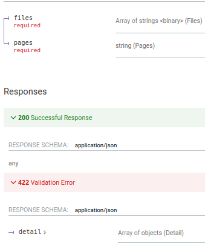

# Петров Семен

- 12.05 Добавил дизайн 
- 22 06 Добавил проект и описание API

# Описание API

#### Преобразование TXT в PDF
- Необходимо загрузить TXT файл через форму

#### Преобразование IMG в PDF
- Необходимо загрузить IMG файл через форму

#### Объединение нескольких PDF
- Необходимо загрузить несколько PDF файлов через форму

#### Вырезать диапазон страниц из PDF
- Необходимо загрузить PDF файл через форму и указать допустимый диапазон страниц (2-7 или 11-19)

